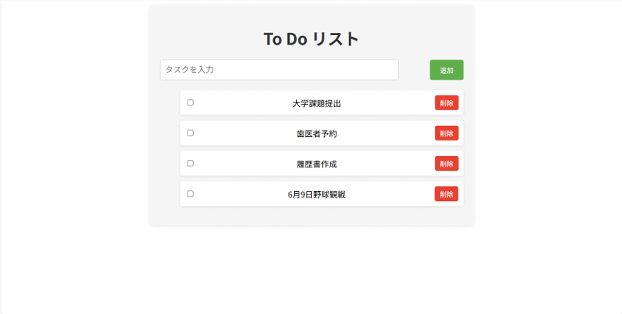

-アプリ名-
To Do リスト

-アプリ概要-
タスクの追加、削除、完了管理のできるシンプルなタスク管理アプリです。

React、CSS、Javascript、HTMLの学習を目的として作成しました。なお現在はReactを利用して実装しているため、JavascriptおよびHTML
を直接記述する機会は限定的ですが、開発過程でこれらの基礎知識を利用しています。

-使用技術-
・React
・CSS
・Vite

-主な機能-
・タスク追加
・タスク削除
・タスク完了切り替え

-画面イメージ-

-今後の改善予定-
・緊急度に合わせたソートの実装
・タスクの一括完了、削除機能

# React + Vite

This template provides a minimal setup to get React working in Vite with HMR and some ESLint rules.

Currently, two official plugins are available:

- [@vitejs/plugin-react](https://github.com/vitejs/vite-plugin-react/blob/main/packages/plugin-react) uses [Oxc](https://oxc.rs)
- [@vitejs/plugin-react-swc](https://github.com/vitejs/vite-plugin-react/blob/main/packages/plugin-react-swc) uses [SWC](https://swc.rs/)

## React Compiler

The React Compiler is not enabled on this template because of its impact on dev & build performances. To add it, see [this documentation](https://react.dev/learn/react-compiler/installation).

## Expanding the ESLint configuration

If you are developing a production application, we recommend using TypeScript with type-aware lint rules enabled. Check out the [TS template](https://github.com/vitejs/vite/tree/main/packages/create-vite/template-react-ts) for information on how to integrate TypeScript and [`typescript-eslint`](https://typescript-eslint.io) in your project.
